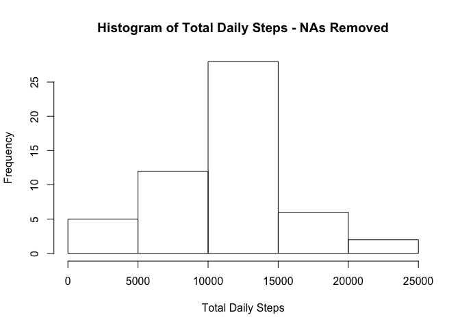
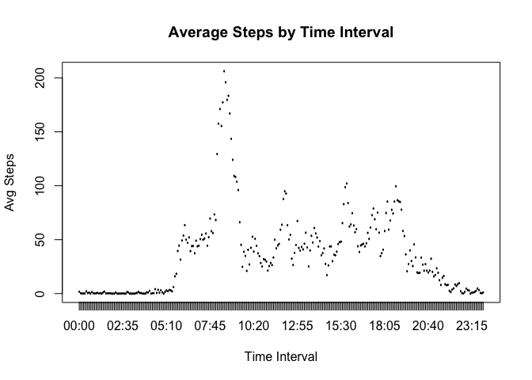
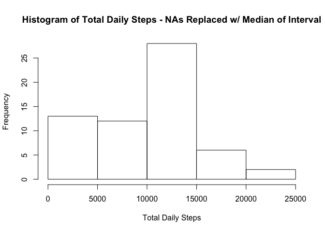
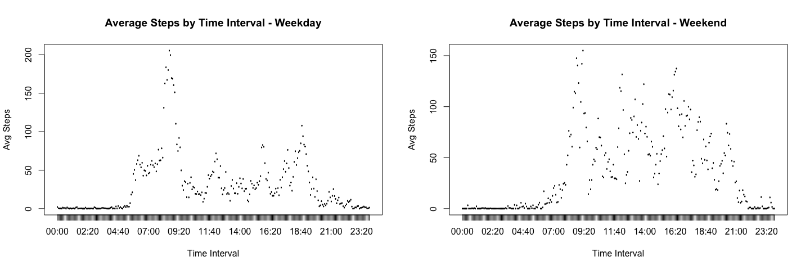

# Reproducible Research: Peer Assessment 1
David Haworth  
***
### Loading and preprocessing the data


```r
# Import the plyr and stringr libraries for use within the report
library(plyr)
library(stringr)

# Functions for replacing NAs in step count numeric vector with median or mean values
calc_median <- function(x) replace(x, is.na(x), median(x, na.rm=TRUE))
calc_mean <- function(x) replace(x, is.na(x), mean(x, na.rm=TRUE))

# Function to aggregate the total steps by day for provided data
aggregate_daily_steps <- function(x) setNames(
    aggregate(
        x$steps, 
        by = list(x$date), 
        sum
    ), 
    c("Date","Steps")
)

# Function to aggregate the average steps by interval for provided data
calc_avg_steps_for_interval <- function(x) setNames(
    aggregate(
        x$steps, 
        by=list(
            sub("([[:digit:]]{2,2})$", ":\\1",
                str_pad(
                    x$interval, 
                    4, 
                    side="left", 
                    pad="0"
                )
            )
        ), 
        ave
    ), 
    c("Interval", "Steps")
)

# Download the zip file containing the activity data, unzip the data file, and load it
download.file(
    url = "https://d396qusza40orc.cloudfront.net/repdata%2Fdata%2Factivity.zip", 
    destfile = "data.zip", 
    method = 'curl'
)
unzip("data.zip")
all_activity <- read.csv("activity.csv")

# Activity data with NAs removed
activities_na_removed <- na.omit(all_activity)

# Activity data with NAs filled with the median number of steps for the corresponding interval
activities_na_replaced <- ddply(all_activity, ~ interval, transform, steps = calc_median(steps))

# Add a 'daytype' column to discriminate whether each activity record occurred on a weekday or weekend
activities_na_replaced$daytype <- 
    ifelse(weekdays(as.Date(activities_na_replaced$date)) %in% c("Saturday","Sunday") , "weekend", "weekday")
```
***
### What is mean total number of steps taken per day?


```r
# Aggregate the number of steps by day for data with NAs removed
total_steps_na_removed <- aggregate_daily_steps(activities_na_removed)

# Display histogram of total daily steps
hist(
    total_steps_na_removed$Steps, 
    main = "Histogram of Total Daily Steps - NAs Removed", 
    xlab = "Total Daily Steps"
)
```

 


```r
# Calculate the mean of all steps taken (NAs removed), rounded to three decimal places
mean_total_steps_na_removed <- format(mean(total_steps_na_removed$Steps),3)

# Calcluate the median of all steps taken (NAs removed)
median_total_steps_na_removed <- median(total_steps_na_removed$Steps)
```

#### Daily Step Total - *Mean:* **10766.19** *Median:* **10765**
***
### What is the average daily activity pattern?


```r
# Get the average number of steps for each 5 minute interval of the day
int_avg <- calc_avg_steps_for_interval(activities_na_removed)

# Plot the average number of steps for each 5 minute interval of the day
plot(
    x=as.factor(int_avg$Interval), 
    y=int_avg$Steps, 
    type="l", 
    main="Average Steps by Time Interval", 
    xlab="Time Interval", 
    ylab="Avg Steps"
)
```

 


```r
# Find the interval that had the highest step average
interval_with_max_steps <- int_avg[which.max(int_avg$Steps),]$Interval

# Find the highest average step value for all intervals
max_steps <- format(max(int_avg$Steps),3)
```
#### Interval with the maximum value - *Interval:* **08:35** *Steps:* **206.1698**

***
### Imputing missing values


```r
# Calculate total number of NAs in full activity data
total_na_count <- sum(is.na(all_activity$steps))
```
#### Total number of NA values in dataset: **2304**


```r
# Aggregate the number of steps for each day for data with NAs replaced
total_steps_na_replaced <- aggregate_daily_steps(activities_na_replaced)

# Plot histogram of total daily steps
hist(
    total_steps_na_replaced$Steps, 
    main = "Histogram of Total Daily Steps - NAs Replaced w/ Median of Interval", 
    xlab = "Total Daily Steps"
)
```

 


```r
# Calculate the mean of all steps taken (NAs replaced w/ median), rounded to three decimal places
mean_total_steps_na_replaced <- format(mean(total_steps_na_replaced$Steps),3)

# Calcluate the median of all steps taken (NAs replaced w/ median)
median_total_steps_na_replaced <- median(total_steps_na_replaced$Steps)
```
#### Daily Step Total - *Mean:* **9503.869** *Median:* **10395**


```r
# Calculate diff of mean w/ NAs removed and mean w/ NAs replaced
mean_diff <- as.numeric(mean_total_steps_na_removed) - as.numeric(mean_total_steps_na_replaced)

# Calculate diff of median w/ NAs removed and median w/ NAs replaced
median_diff <- as.numeric(median_total_steps_na_removed) - as.numeric(median_total_steps_na_replaced)
```
#### Differences from NA removed - *Mean Diff:* **1262.321** *Median Diff:* **370**

Both the mean and median total steps values are higher when the NAs are removed then when they are replaced with the median value for the given interval.

***
### Are there differences in activity patterns between weekdays and weekends?


```r
# Get the average steps by interval for weekdays
wkday_avg <- calc_avg_steps_for_interval(activities_na_replaced[activities_na_replaced$daytype == 'weekday', ])

# Get the average steps by interval for weekends
wkend_avg <- calc_avg_steps_for_interval(activities_na_replaced[activities_na_replaced$daytype == 'weekend', ])

# Plot weekday interval averages and weekend interval averages for comparison
par(mfrow=c(1,2))
plot(
    x=as.factor(wkday_avg$Interval), 
    y=wkday_avg$Steps, 
    type="l", 
    main="Average Steps by Time Interval - Weekday", 
    xlab="Time Interval", 
    ylab="Avg Steps"
)
plot(
    x=as.factor(wkend_avg$Interval), 
    y=wkend_avg$Steps, 
    type="l", 
    main="Average Steps by Time Interval - Weekend", 
    xlab="Time Interval", 
    ylab="Avg Steps"
)
```

 

Comparison shows that weekday step activity spikes in the morning, then remains lower throughout the day, with only small spikes around lunch and mid-afternoon, before a higher spike in the evening. Weekend step activity also spikes in the morning, but activity throughout the day remains much higher in comparison to weekdays.

***
